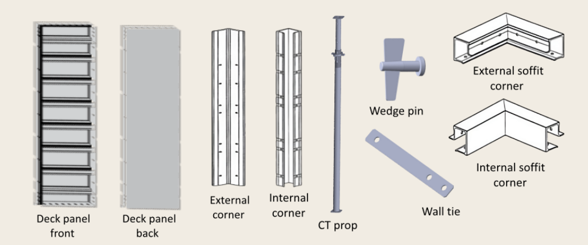
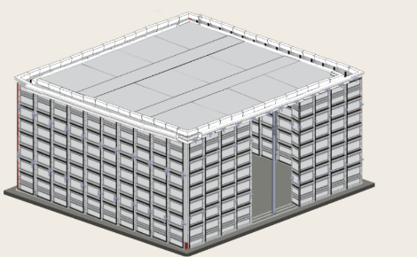

### Procedure

#### Apparatus Material:  

Base Plate, Rebar, Deck panel, Mid Beam, CT prop, Wedge Pins, Wall Corner, Wall Tie, Soffit, etc.

   

#### Step 1 
Attaching the deck panels all around the rebars i.e. iron bars with the help of wedge pin. Deck panels are supported at end with external corners. 

#### Step 2 
Attaching rebar mesh with wall panel & wall tie with PVC sleeves to fit the panel with rebar. 

#### Step 3 
Attaching the inner deck panels all around the rebars i.e. iron bars with the help of wedge pin. Deck panels are supported at end with internal corners. 

#### Step 4 
Attaching internal and external soffit with wedge pin to support the roof panels. 

#### Step 5 
Similarly construct right and left wall using previous steps. 

#### Step 6 
Place similar system for front wall excluding at door location. Place CT props in middle of door frame and  place top panel over it and attach top panel with deck panel and CT props. Again attach wall soffit to front wall in similar way like other walls.  

#### Step 7 
Placing CT props, beam and panel to setting the roof. 

  

